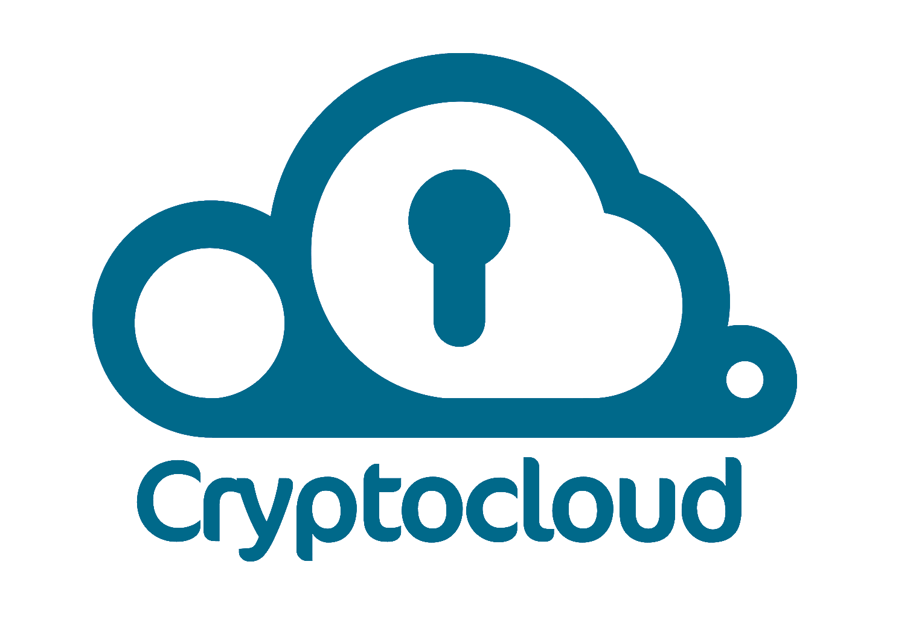

  

Multi-platform command-line storage for sensible data in the cloud, able to connect to remote machines and developed for teams. 

## Features
- Creation of a shared filesystem between every user 
- Creation of team and management of their authorizations using signatures
- Management of users and their authorizations using public keys and signatures
- Creation of encrypted folders shared between teams (PwdFolder)
- Creation of encrypted files containing data used to connect to a remote machine (PwdEntry)
- Automatic recovery of passwords
- Automatic management of messages between users
- Automatic connection to a remote host

## Structure
### Roles

> if the caller has no access or is the owner of the shared filesystem  then is an Admin, otherwise is an User 
 
#### Admin
- Invite users to the shared filesystem
- Sign users' publickeys
- Sign groups ownership

#### User:
- Connect to a remote machine
- List every Groups created
- List every PwdEntry accessible
- Create a Group
- Create a PwdFolder
- Create a PwdEntry
- Add Groups to PwdFolder
- Add Members to PwdFolder

> For a complete list of commands, write 'help' inside CryptoCloud

### Filesystem

	Dropbox
	│
	├──PersonalFolder
	│	├──MyPwdFolder
	│	│	├──CompleteInfoPwdFolder3 
	│	│	└──...             
	│	├──Group1
	│	│	├──InfoPwdFolder2 
	│	│	└──...             
	│	└──Group2
	│		├──InfoPwdFolder1
	│		└──... 
	│
	├──System                    
	│   ├──PublicKeys 
	│	│	├──User1.publickey
	│	│	└──User2.publicey
	│   ├──GroupsComposition
	│	│	├──Group1 
	│	│	└──Group2              
	│   ├──SignedGroups
	│	│	├──Group1.sign 
	│	│	└──Group2.sign           
	│   └──MessagePassing            
	│   	├──Admin
	│		│	├──Notification1 
	│		│	└──...         
	│		├──User1
	│		│	├──Notification2 
	│		│	└──...
	│		└──User2  
	│			├──Notification5 
	│			└──...       
	│
	├──SignedPublicKeys
	│	├──Admin.admin 
	│	├──User1.sign
	│	└──User2.sign
	│
	├──SignedGroupsOwner
	│	├──Group1.admin 
	│	└──Group2.admin
	│
	├──PwdFolder1
	│	├──PwdEntry1
	│	└──...
	└──...

### Folders Permissions:
- PersonalFolder: Each user has its own, isn't shared with anyone	
- System: Write permission for everyone
- SignedKeys: Write permission only for the admin
- SignedGroupsOwner: Write permission only for the admin
- PwdFolder: Owner decides which groups to share with and with what permissions

	

## 3th Party Software Used
### Cryptofs
Usage: encrypt and decrypt PwdFolders 
[Repository](https://github.com/cryptomator/cryptofs "CryptoFs Homepage") 
### Dropbox SDK
Usage: cloud storage service decided to implement
[Repository](https://github.com/dropbox/dropbox-sdk-java "Dropbox Homepage") 
### Jsch
Usage: connect to ssh or sftp on remote machines 
[Homepage](http://www.jcraft.com/jsch/ "Jsch Homepage") 

## Building 
### Dependencies
- Java 10
- Maven 3
- Dropbox sync client [Download](https://www.dropbox.com/downloadin "Download")

### Run Maven
Modify  inside src/main/java/Management/Cloud/Dropbox.java KEY_INFO and SECRET_INFO with your key and secret, obtainable
[here](https://www.dropbox.com/developers/apps "Dropbox Developers")
	
	$ mvn clean install
	$ java -jar target/CryptoCloud.jar

Share the jar to your future users

